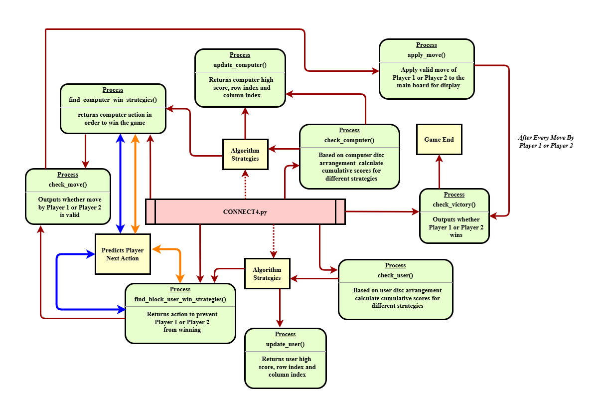

## Connect Four Game
Connect4 or Connect Four is a game in which the players choose a color and then take turns dropping colored tokens into a six-row, seven-column vertically suspended grid. The pieces fall straight down,occupying the lowest available space within the column. The objective of the game is to be the first to form a horizontal, vertical, or diagonal line of four of one's own tokens.

Connect Four is a two-player game with perfect information for both sides, meaning that nothing is hidden from anyone. Connect Four also belongs to the classification of an adversarial, zero-sum game, since a player's advantage is an opponent's disadvantage.

One measure of complexity of the Connect Four game is the number of possible games board positions. For classic Connect Four played on a 7-column-wide, 6-row-high grid, there are 4,531,985,219,092 (about 4.5 trillion) positions for all game boards populated with 0 to 42 pieces. Connect Four is a solved game. The first player can always win by playing the right moves.

(description taken from wikipedia: http://en.wikipedia.org/wiki/Connect_Four)

This code is implemented in python and is played via the terminal.
Play with the computer on a (6-rows x 7-columns) board or have a 2-player game with your buddy ! :)

(7x7) board may be desired for symmetrical reasons for but this version follows the classic 6-rows and 7-columns grid. Players choose a color (Player 1 or Player 2), and take turn dropping their colored chips from the top row down a column. The first player to get four chips in a row (vertical, horizontal, or diagonal) wins!

Source:
https://sites.ps.uci.edu/mathceo/meeting-3/connect-4#:~:text=Connect%204%20is%20a%20two,horizontal%2C%20or%20diagonal)%20wins!


## Code Flowchart Visualisation:



## Copyright and Authorship:
Author: Russell Cho

1. This repository, including all its contents, is protected by copyright laws. If you wish to use, modify, or distribute any part of this repository, please contact [Russell] at [rcho002@e.ntu.edu.sg] for more details.
2. For potential collaboration, please contact the author as well.


### How to run:
```
python connect4.py
```